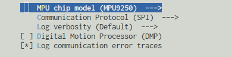

[](https://esp32-mpu-driver.readthedocs.io/en/latest)
[](https://travis-ci.org/natanaeljr/esp32-MPU-driver)
[](LICENSE)

![MPU Driver][Banner]

[Banner]: docs/source/_static/MPUdriver.jpg

A library for _Invensense_ MPU chips.
It is written in C++ and designed for working with **[ESP32]** microcontroller _[esp-idf]_ framework.
Supports both SPI and I2C protocols interchangeably, selectable bus port, and even multiple connected MPUs.

[ESP32]: https://www.espressif.com/en/products/hardware/esp32/overview
[esp-idf]: https://github.com/espressif/esp-idf/

## Models

|     part      |      sensors       |   protocol   |
| ------------: | :----------------: | :----------- |
| **[MPU6000]** | Gyro/Accel         | _I2C_, _SPI_ |
| **[MPU6050]** | Gyro/Accel         | _I2C_        |
| **[MPU6500]** | Gyro/Accel         | _I2C_, _SPI_ |
|  **MPU6555**  | Gyro/Accel         | _I2C_, _SPI_ |
| **[MPU9150]** | Gyro/Accel/Compass | _I2C_        |
| **[MPU9250]** | Gyro/Accel/Compass | _I2C_, _SPI_ |
|  **MPU9255**  | Gyro/Accel/Compass | _I2C_, _SPI_ |

[MPU6000]: https://www.invensense.com/products/motion-tracking/6-axis/mpu-6050/
[MPU6050]: https://www.invensense.com/products/motion-tracking/6-axis/mpu-6050/
[MPU6500]: https://www.invensense.com/products/motion-tracking/6-axis/mpu-6500/
[MPU9150]: https://www.invensense.com/products/motion-tracking/9-axis/mpu-9150/
[MPU9250]: https://www.invensense.com/products/motion-tracking/9-axis/mpu-9250/

## Features

- [x] Support to SPI and I2C protocol (with selectable port)
- [x] Basic configurations (sample rate _(4Hz~32KHz)_, clock source, full-scale, standby mode, offsets, interrupts, DLPF, etc..)
- [x] Burst reading for all sensors
- [x] Low Power Accelerometer mode _(various rates, e.g. 8.4μA at 0.98Hz)_
- [x] Low Power Wake-on-motion mode _(with motion detection interrupt)_
- [x] FIFO buffer access for all internal and external sensors
- [x] Complete Auxiliary I2C support for external sensors _(up to 4)_
- [x] External Frame Synchronization _(FSYNC)_ pass-through interrupt
- [x] Motion, Zero-motion and Free-Fall detection _(as motion detection interrupt)_
- [x] Total access to the Magnetometer _(even when MPU connected by SPI protocol)_
- [x] Calibration for Gyro and Accel
- [x] Self-Test _(true implementation from MotionApps)_

#### DMP

- [ ] Quaternion (3-axis Gyroscope)
- [ ] Quaternion (6-axis Gyroscope and Accelerometer)
- [ ] Screen Orientation (Android's screen rotation algorithm)
- [ ] Tap Detection
- [ ] Pedometer
- [ ] Gyroscope calibrated data

# Getting Started

## Prerequisites

MPU driver depends on the following protocol libraries to communicate with the chip with ease: [ [I2Cbus] | [SPIbus] ].  
You must download the one according to the protocol you'll use and place within your components directory as well.

```
I2Cbus:  git clone https://github.com/natanaeljr/esp32-I2Cbus.git I2Cbus
SPIbus:  git clone https://github.com/natanaeljr/esp32-SPIbus.git SPIbus
```

**_Note:_** At least one of these libraries must be installed as components for the MPU library to work. It won't work otherwise.

[I2Cbus]: https://github.com/natanaeljr/esp32-I2Cbus
[SPIbus]: https://github.com/natanaeljr/esp32-SPIbus

## Installation

Download the repository [here](https://github.com/natanaeljr/esp32-MPU-driver/archive/master.zip),
or clone it right into your project components directory with the following command.

```
git clone https://github.com/natanaeljr/esp32-MPU-driver.git MPUdriver
```

This way you can easily update the library with `git pull` whenever a update is available.

## Usage

First of all, make sure MPU Driver is a component in you project, then run `make menuconfig`, select your chip model and communication protocol you'll use browsing through to `Component config` -> `MPU Driver`.



Now, in your source code, include the mpu main header `MPU.hpp`, the communication library `I2Cbus.hpp` or `SPIbus.hpp` and any other mpu headers that you'll use. Then get the bus ready as shown below.

```C++
#include "MPU.hpp"        // main file, provides the class itself
#include "mpu/math.hpp"   // math helper for dealing with MPU data
#include "mpu/types.hpp"  // MPU data types and definitions
#include "I2Cbus.hpp"
// ...
i2c0.begin(SDA, SCL, CLOCK);  // initialize the I2C bus
```

And for SPI:

```C++
#include "MPU.hpp"        // main file, provides the class itself
#include "mpu/math.hpp"   // math helper for dealing with MPU data
#include "mpu/types.hpp"  // MPU data types and definitions
#include "SPIbus.hpp"
// ...
hspi.begin(MOSI, MISO, SCLK);  // initialize the SPI bus
spi_device_handle_t mpu_spi_handle;
hspi.addDevice(SPIMODE, CLOCK, CS_PIN, &mpu_spi_handle);
```

**Note**: You can initialize/configure the bus through the _esp-idf_ API normally, it should work just fine too.

Create a MPU object, setup and initialize it.

```C++
MPU_t MPU;         // create an object
MPU.setBus(i2c0);  // set communication bus, for SPI -> pass 'hspi'
MPU.setAddr(mpud::MPU_I2CADDRESS_AD0_LOW);  // set address or handle, for SPI -> pass 'mpu_spi_handle'
MPU.testConnection()  // test connection with the chip, return is a error code
MPU.initialize();  // this will initialize the chip and set default configurations
```

Call `set` functions to configure the chip as needed.

```C++
MPU.setSampleRate(250);  // in (Hz)
MPU.setAccelFullScale(mpud::ACCEL_FS_4G);
MPU.setGyroFullScale(mpud::GYRO_FS_500DPS);
MPU.setDigitalLowPassFilter(mpud::DLPF_42HZ);  // smoother data
MPU.setInterruptEnabled(mpud::INT_EN_RAWDATA_READY);  // enable INT pin
```

Read sensor data:

```C++
mpud::raw_axes_t accelRaw;     // holds x, y, z axes as int16
mpud::raw_axes_t gyroRaw;      // holds x, y, z axes as int16
MPU.acceleration(&accelRaw);  // fetch raw data from the registers
MPU.rotation(&gyroRaw);       // fetch raw data from the registers
printf("accel: %+d %+d %+d\n", accelRaw.x, accelRaw.y, accelRaw.z);
printf("gyro: %+d %+d %+d\n", gyroRaw[0], gyroRaw[1], gyroRaw[2]);
```

Convert to more readable formats.

```C++
mpud::float_axes_t accelG = mpud::accelGravity(accelRaw, mpud::ACCEL_FS_4G);  // raw data to gravity
mpud::float_axes_t gyroDPS = mpud::gyroDecPerSec(gyroRaw, mpud::GYRO_FS_500DPS);  // raw data to º/s
printf("accel: %+.2f %+.2f %+.2f\n", accelG[0], accelG[1], accelG[2]);
printf("gyro: %+.2f %+.2f %+.2f\n", gyroDPS.x, gyroDPS.y, gyroDPS.z);
```

The API provides many other functions to manage and operate the sensor in its full potencial. See 
<a href="https://natanaeljr.github.io/esp32-MPU-driver" target="_blank">
<b>API Reference</b>
</a>.

## Tests

See [MPU Unit Test] for more information.

[MPU Unit Test]: test/README.md

## License

This project is licensed under the MIT License - see the [LICENSE](LICENSE) file for details.

Copyright © 2017-2018, Natanael Josue Rabello [_natanael.rabello@outlook.com_]

---
